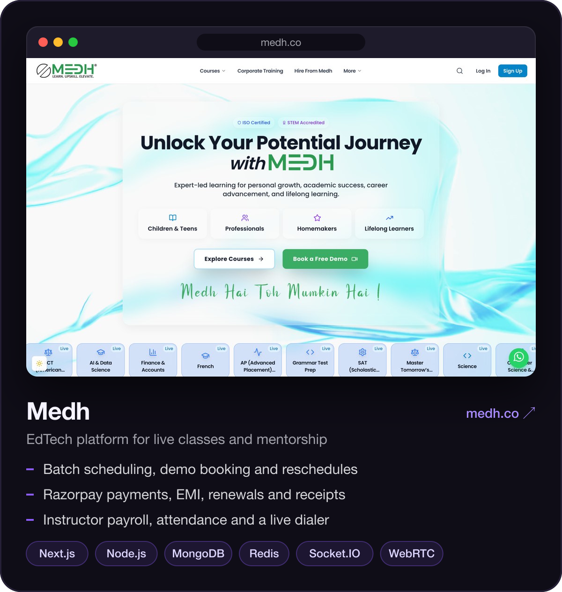
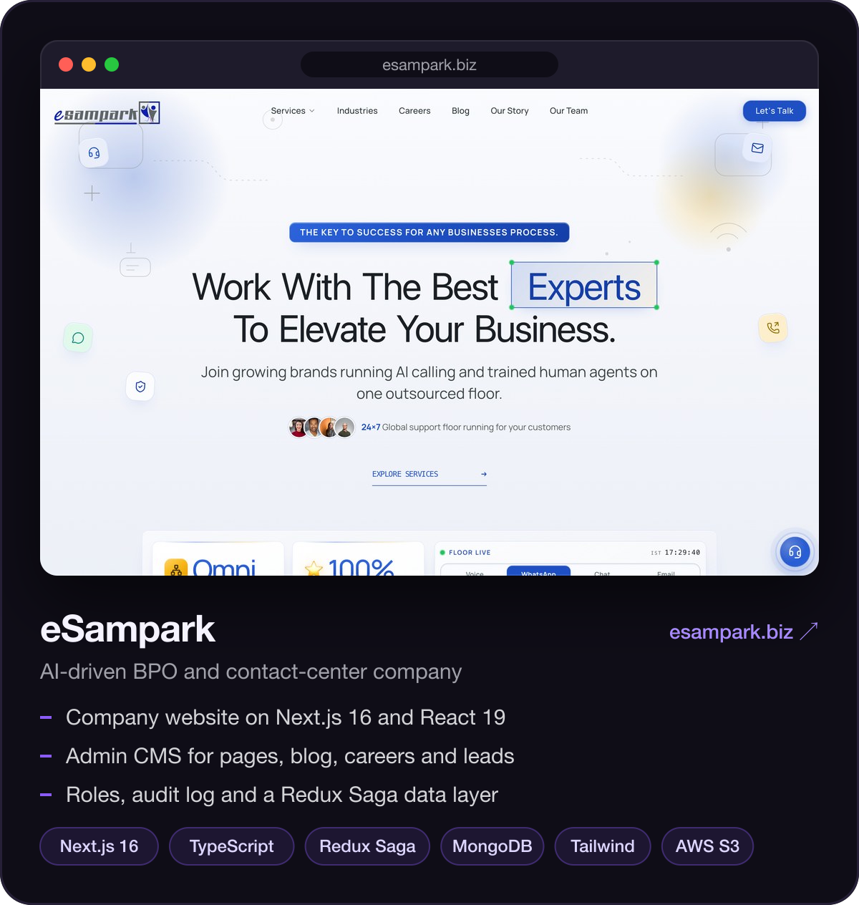

  

 

Hi, I'm Amit. I've been a software development engineer at **eSampark Tech Solutions** in Gurugram since August 2025. I usually own a feature end to end: the Mongo schema, the API, the admin screen, and the UI people actually use.

### Work

  
  

### Stack

  

Also in the mix: BullMQ, Socket.IO, WebRTC, Razorpay, Zoom SDK, Tiptap, GSAP, PM2, Prometheus and Grafana.

### Contact

[LinkedIn](https://www.linkedin.com/in/amit-katare-a412a425a) · [Email](mailto:akatare098@gmail.com) · [medh.co](https://medh.co) · [esampark.biz](https://esampark.biz)
