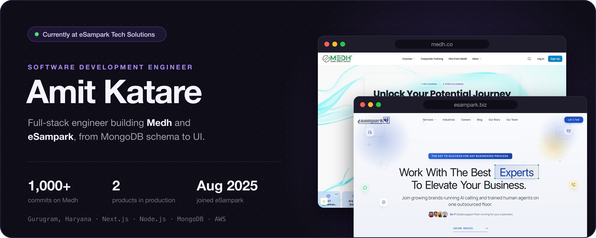
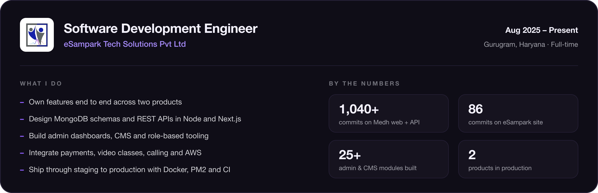
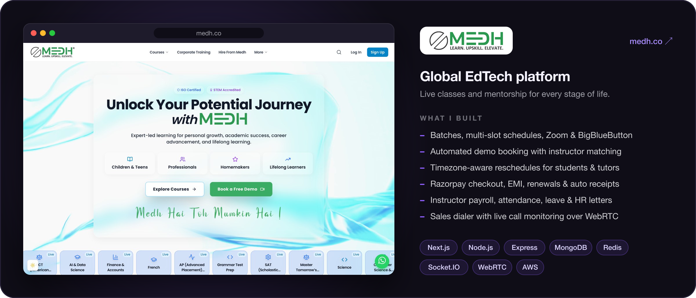
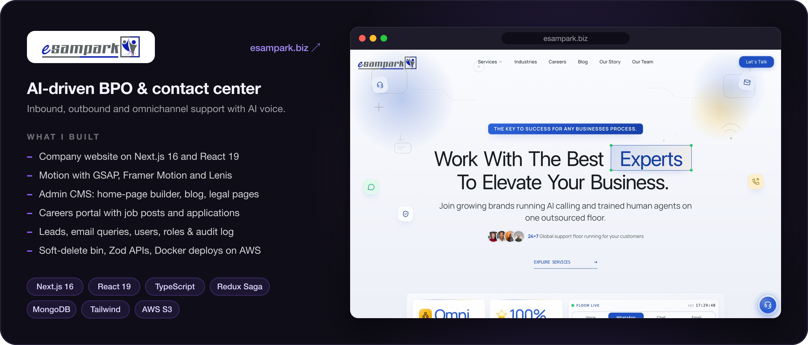
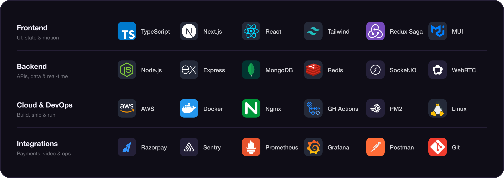
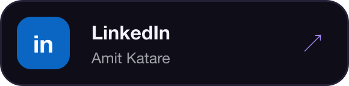
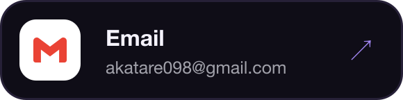
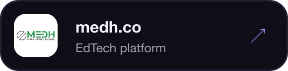
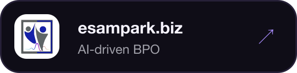

  

 

Hi, I'm Amit — a full-stack engineer at **eSampark Tech Solutions** in Gurugram, working there since **August 2025**. I build and run two products in production: **Medh**, a global edtech platform, and **eSampark**, an AI-driven BPO and contact-center company. Most of my work is owning a feature end to end — the MongoDB schema, the REST API, the admin screen, and the UI people actually use — and shipping it through staging to production.

 

### Experience

  

 

### Selected work

  

  

 

### Tech stack

  

Also in the mix: BullMQ, Zod, TanStack Query, Tiptap, GSAP, Framer Motion, Zoom SDK, BigBlueButton, Twilio, OpenAI and Jaeger.

  

### Get in touch

  
  
  
  

 

  

