  

  
  
  
  
  

 

## 💼 What I build at eSampark Tech Solutions

I’m a **Software Development Engineer** at **eSampark Tech Solutions Pvt Ltd**, Gurugram — shipping two production products end-to-end, from **MongoDB schema → REST APIs → admin dashboards → animated, mobile-first UI**.

  
  

<b>🔍 Deep dive — what I’ve shipped (click to expand)</b>

 

**🎓 Medh — Global EdTech platform**

- **Live classes & scheduling** — batch management, multi-slot schedules, automated demo-booking with instructor assignment, timezone-aware reschedules, Zoom & BigBlueButton links and session recordings
- **Payments** — Razorpay checkout & webhooks, EMI, renewals, auto-generated INR receipts, course / batch / demo-batch pricing
- **HRMS & payroll** — instructor payroll priced from conducted sessions, attendance, shifts, breaks, comp-off, leave & regularisation, employee-letter PDFs stored on S3 and emailed
- **Real-time calling** — sales dialer with live counts, Live Call Management for supervisors using WebRTC + Socket.IO + TeleCMI streaming, call logs & EOD Excel exports

**🎧 eSampark — AI-driven BPO & contact center**

- **Marketing website** — Next.js 16 App Router + React 19, services / industries / blog / careers / team pages, GSAP + Framer Motion + Lenis motion, SEO-ready installable PWA
- **Admin dashboard & CMS** — home-page builder (hero, solutions, impact, sectors, FAQs), Tiptap rich-text blog & legal pages, careers & applications, lead and email queries
- **Platform** — user & role management, audit log, soft-delete bin with restore / purge, Redux Saga data layer, Zod-validated APIs, AWS S3 media

 

## 🛠️ Tech stack

<table align="center">
  <tr>
    <td align="right"><b>Frontend</b></td>
    <td></td>
  </tr>
  <tr>
    <td align="right"><b>Backend</b></td>
    <td></td>
  </tr>
  <tr>
    <td align="right"><b>Cloud &amp; DevOps</b></td>
    <td></td>
  </tr>
  <tr>
    <td align="right"><b>Tools</b></td>
    <td></td>
  </tr>
</table>

 

## 📊 Contribution dashboard

  

  <picture>
    <source media="(prefers-color-scheme: dark)" srcset="https://raw.githubusercontent.com/Amitkatare19/Amitkatare19/output/github-snake-dark.svg" />
    <source media="(prefers-color-scheme: light)" srcset="https://raw.githubusercontent.com/Amitkatare19/Amitkatare19/output/github-snake.svg" />
    
  </picture>

 

## 🚀 Side projects

| Project | What it is | Stack |
|---|---|---|
| 🛒 [E-commerce Website](https://github.com/Amitkatare19/E-commerce-Website-React) | Product listing, cart & checkout | React |
| 🧩 [Full-Stack Project](https://github.com/Amitkatare19/Full-Stack-Project) | Node/Express API + MongoDB + React | MERN |
| 📈 [Stock Predictor](https://github.com/Amitkatare19/Stock-Preditor) | Stock dashboard with trend charts | JavaScript |
| 📇 [Contact Manager](https://github.com/Amitkatare19/Contact-Management-App-React) | CRUD contacts app | React |
| 🤖 [Trygone AI](https://github.com/Amitkatare19/TrygoneAI) · [SaaS](https://github.com/Amitkatare19/Trygone-Saas) | Product landing pages | HTML · CSS |
| 🔥 [30-Day UI Challenge](https://github.com/Amitkatare19?tab=repositories&q=prompt) | 30 UI builds in 30 days | HTML · CSS |

 

  <b>“Code it. Ship it. Make it move.”</b> ✨
   
  Open to collaborations — <a href="mailto:akatare098@gmail.com">say hi</a> or connect on <a href="https://www.linkedin.com/in/amit-katare-a412a425a">LinkedIn</a>.

