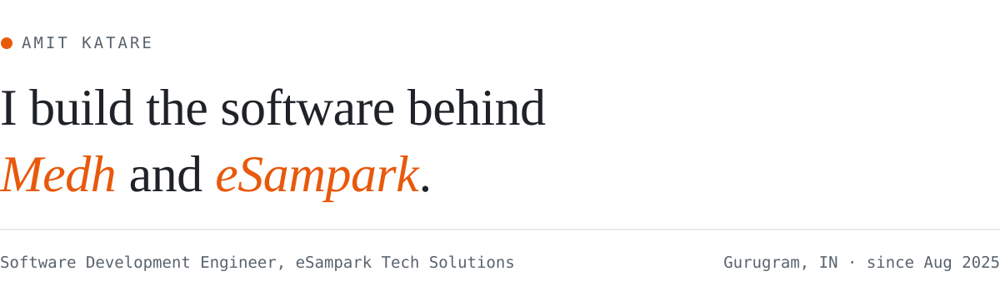

<picture>
  <source media="(prefers-color-scheme: dark)" srcset="assets/banner-dark.svg" />
  
</picture>

 

Hi, I'm Amit. I've been a software development engineer at **eSampark Tech Solutions** in Gurugram since August 2025. I usually own a feature end to end: the Mongo schema, the API, the admin screen, and the bit of UI people actually see.

### What I'm working on

<table>
<tr>
<td width="50%" valign="top">

**[Medh](https://medh.co)** 
An edtech platform with live classes and mentorship.

- Batch scheduling, demo bookings and reschedules across timezones
- Razorpay payments, EMI, renewals and receipts
- Instructor payroll, attendance and leave
- A sales dialer with live call monitoring over WebRTC and Socket.IO

</td>
<td width="50%" valign="top">

**[eSampark](https://esampark.biz)** 
A BPO and contact-center company.

- The company website, on Next.js 16 and React 19
- An admin CMS for pages, blog, careers and leads
- Users, roles, audit log and a restorable bin
- Redux Saga on the client, Zod-validated APIs on the server

</td>
</tr>
</table>

### Stack

<picture>
  <source media="(prefers-color-scheme: dark)" srcset="https://skillicons.dev/icons?i=ts,js,nextjs,react,tailwind,redux,nodejs,express,mongodb,redis,aws,docker,nginx,githubactions&theme=dark" />
  
</picture>

 

Also in the mix: BullMQ, Socket.IO, WebRTC, Razorpay, Zoom SDK, Tiptap, GSAP, PM2, Prometheus and Grafana.

### Elsewhere

[LinkedIn](https://www.linkedin.com/in/amit-katare-a412a425a) · [Email](mailto:akatare098@gmail.com) · [medh.co](https://medh.co) · [esampark.biz](https://esampark.biz)
